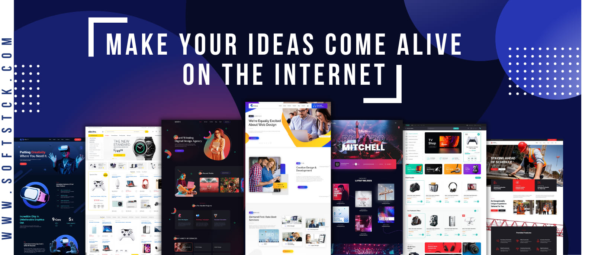

&nbsp;

  

  

- 🔭 I’m currently working on **E-commerce**

- 🌱 I’m currently learning **React And Mongo DB**

- 👯 I’m looking to collaborate on [EvolutionAquerium](https://dev.to/rahuldkjain)

- 🤝 I’m looking for help with **SEO Expert**

- 👨‍💻 All of my projects are available at [softstok.com](softstok.com)

- 📝 I regularly write articles on [softstok.com/blog](softstok.com/blog)

- 💬 Ask me about **Web Development**

- 📫 How to reach me **skshakil591@gmail.com**

- 📄 Know about my experiences [softstok.com/about](softstok.com/about)

<h3 align="left">Connect with me:</h3>

<h3 align="left">Languages and Tools:</h3>

